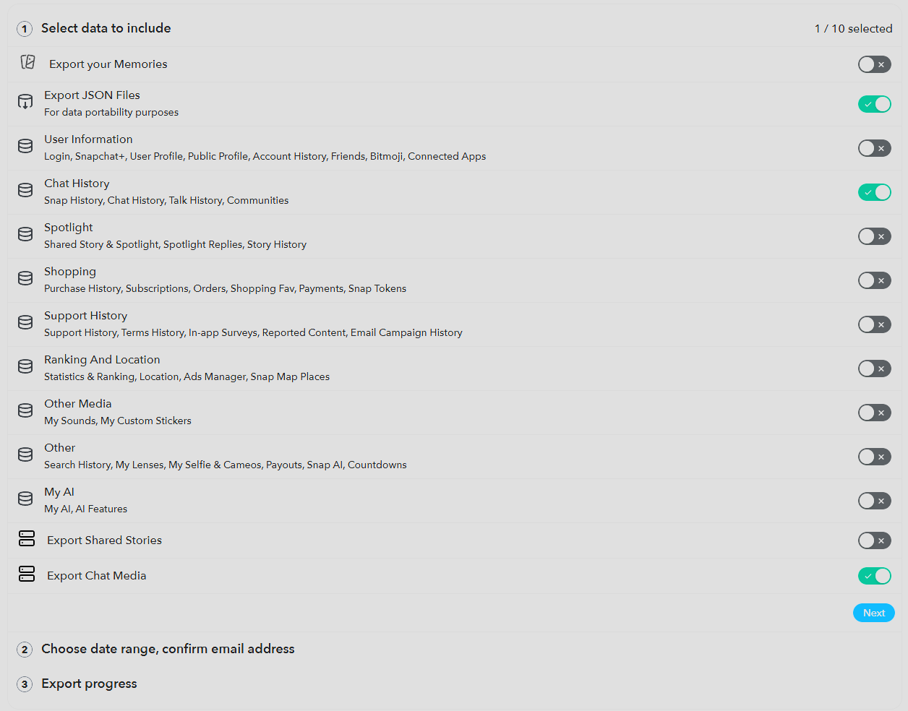

# Snapchat Data Parser & Archive Tool

This project converts your Snapchat data export into a readable, browsable HTML archive with improved formatting, media handling, and chat structure.

---

## 📥 How to Get Your Snapchat Data

1. Go to Snapchat’s official data export page: https://accounts.snapchat.com/v2/download-my-data

2. Log in to your account.

3. Request your data export.

4. When selecting export options, make sure they match the settings below:



5. Download the ZIP file once Snapchat emails it to you.

---

## 📁 Setup

1. Clone or download this repository: `git clone https://github.com/AutoAsteroid/snapchat-parser`

2. Extract the ZIP file inside `data/` so the structure looks like:

```
├───data/
│    ├── json/
│    ├── chat_media/
│    ├── ...
```

3. Run the program: `node main`
---

## 📤 Output

After running, your archived Snapchat data will be generated in the `output/` folder:

```
├───output
│   ├───username_0
│   │   ├───username_0.html
│   │   └───media
│   │       ├───your_username/
│   │       └───username_1/
│   ├───username_1
│   │   ├───username_1.html
│   │   └───media
│   │       ├───your_username/
│   │       └───username_1/
```
## ⚙️ Features

* Converts Snapchat chat exports into HTML
* Embeds media (images, videos, voice notes)
* Groups messages by date
* Handles multi-media messages
* Improves readability over Snapchat’s raw export format


## 📌 Notes

* This tool works only with official Snapchat data exports.
* Media mapping is inferred from timestamps due to Snapchat not providing consistent media IDs.
* Add name mapping in `config.json` to support your custom friend nicknames.
