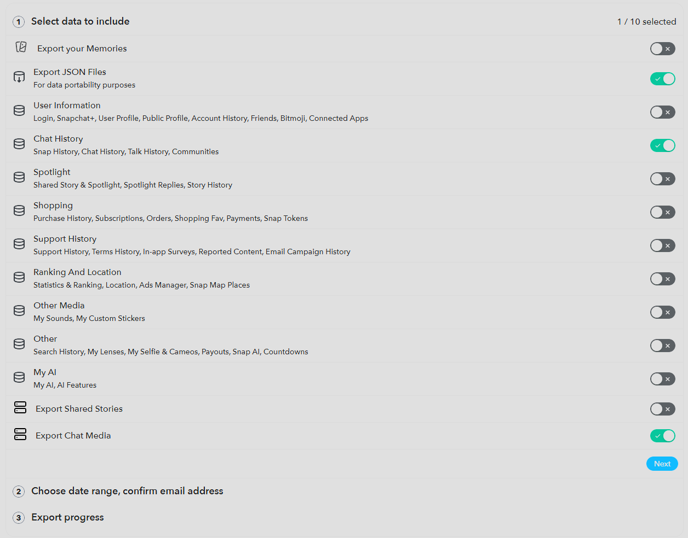

# Snapchat Data Formatter

Snapchat data exports are notoriously user unfriendly for browsing. This program convert your data exports into readable HTML archives with improved formatting, inline media handling, and an actual chat structure over Snapchat's plain and ugly HTML files.

> All your data is processed locally on your machine. Your personal chat history is never uploaded or shared. Your privacy matters!

---

## 📥 How to Get Your Snapchat Data

1. Go to Snapchat’s official data export page: https://accounts.snapchat.com/v2/download-my-data

2. Log in to your Snapchat account and request your data export.

3. When selecting export options, make sure the toggles below are enabled:



4. Choose the date range to export and confirm your email address.

5. Download the ZIP file in the app once Snapchat emails you notifying they are done.

---

## 📁 Setup

1. Clone or download this repository: `git clone https://github.com/AutoAsteroid/snapchat-parser`

2. Extract the ZIP file inside `data/` so the structure looks like:

```
├───data/
│    ├── chat_media/
│    ├── html/
│    ├── json/
│    ├── index.html
│    ├── ...
```

3. Rename `example.config.json` to `config.json` and remove the comments.

4. Run the program: `npm start`

5. Watch all your chats automatically format into improved HTML files!


## 📤 Output

After running, your formatted Snapchat data will be generated in the `output/` folder:

```
├───output
│   ├───username_0
│   │   ├───username_0.html
│   │   └───media
│   │       ├───your_username/
│   │       └───username_0/
│   ├───username_1
│   │   ├───username_1.html
│   │   └───media
│   │       ├───your_username/
│   │       └───username_1/
```

You can view your archived chats in the generated HTML files under their respective usernames. The media subfolders are your organized media files for that specific chat, which also fixes the problem with Snapchat dumping all your media into the same `chat_media/` folder!

---

## ⚙️ Features

- Converts Snapchat chat exports into HTML
- Embeds all media (snaps, images, videos, and voice notes)
- Groups messages by date
- Handles multi-media messages
- Heavily improves readability over Snapchat’s raw export format

## 📌 Notes

- This tool is designed to work exclusively with official Snapchat data exports.
- Map custom friend nicknames to their usernames in the `config.json` file.
- Media mapping is entirely inferred from file timestamps because Snapchat does not provide media IDs for snaps specifically.

## 🖥️ Windows Compatibility

Windows machines handle file creation timestamps differently than macOS and Linux, which can cause media to sync to the wrong chat or miss matches entirely. For the most accurate parsing on Windows, running the tool inside WSL is highly recommended. Learn how to set up WSL here: https://learn.microsoft.com/en-us/windows/wsl/install

## License

This project is licensed under the MIT License. See the [LICENSE](LICENSE) file for details.
